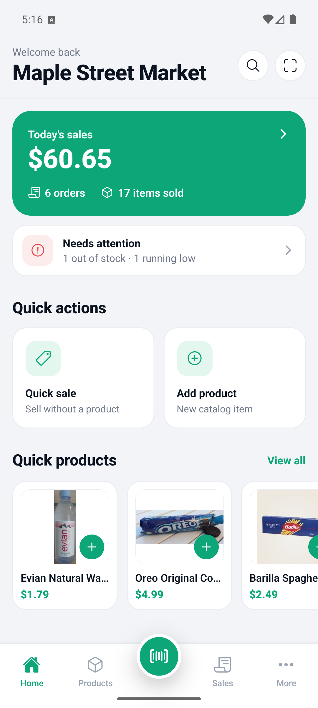
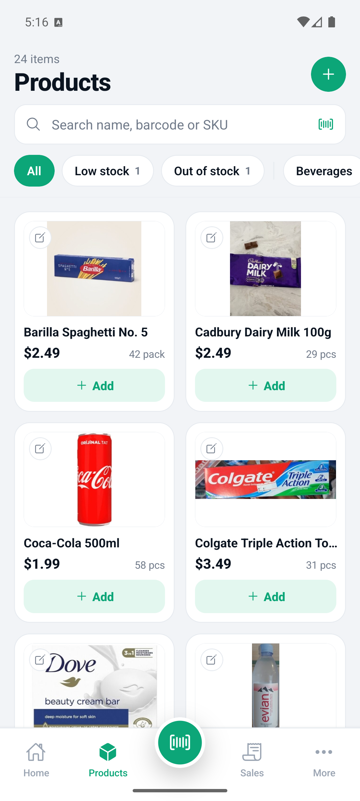
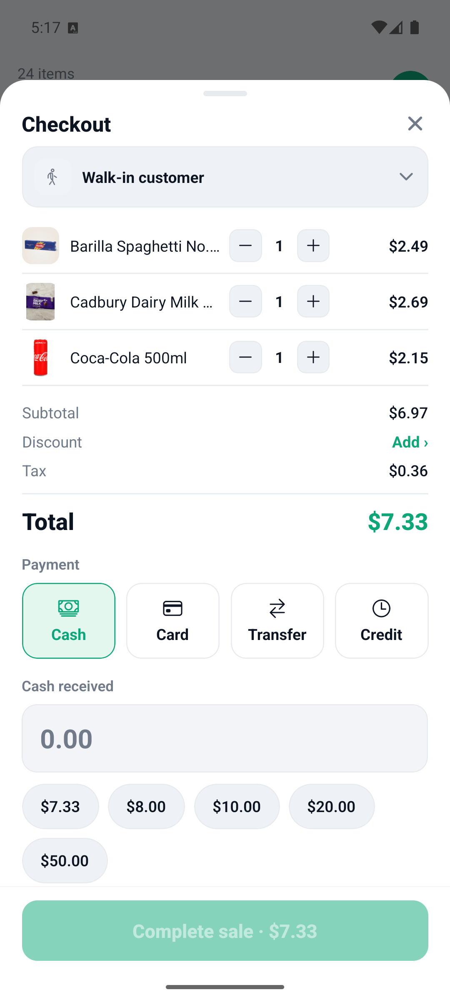
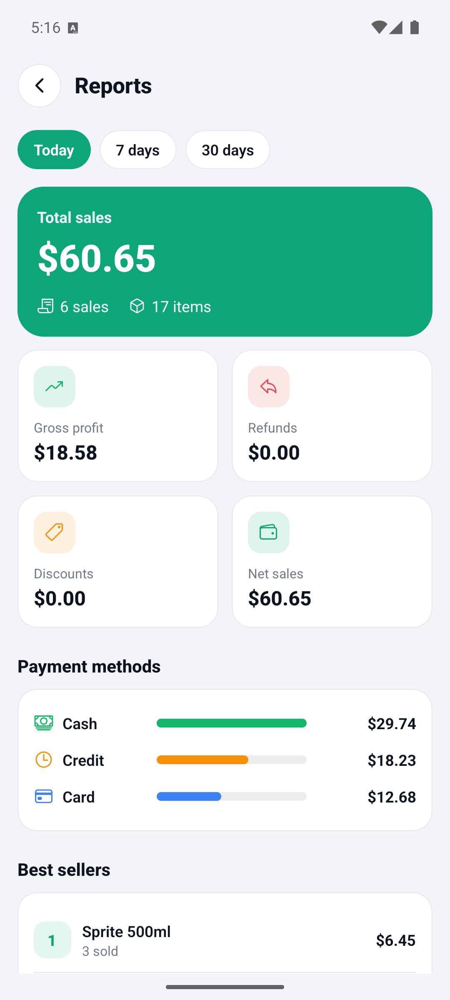
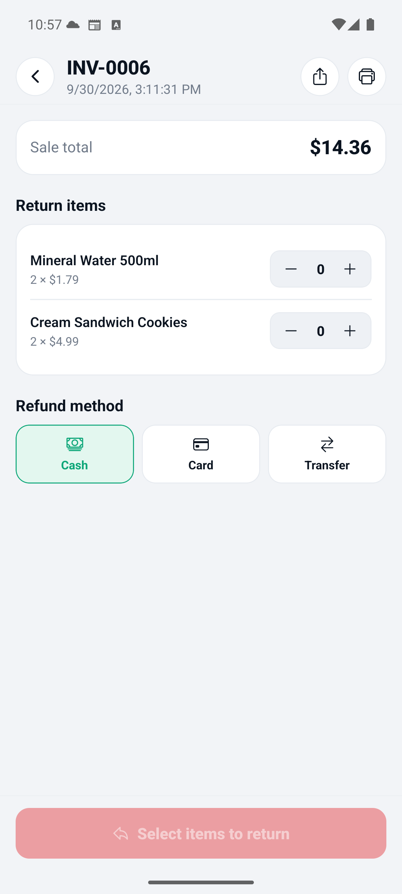
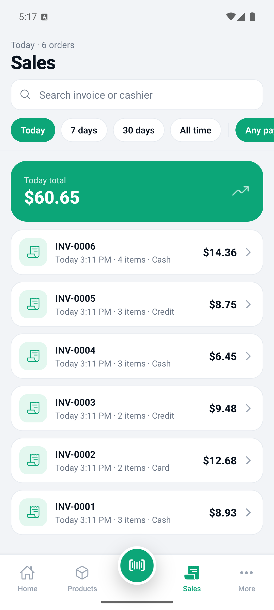
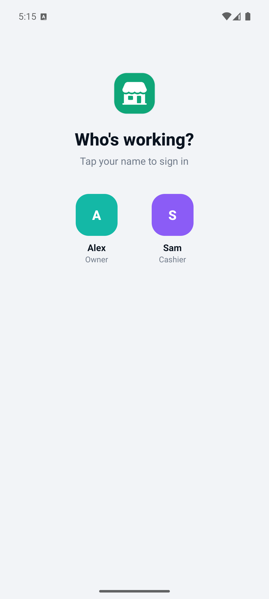
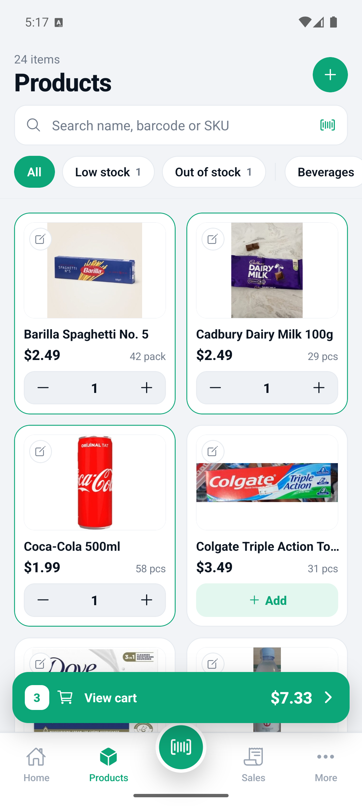

<div align="center">

# OpenPocket POS

**A free, offline-first point-of-sale that lives in your pocket.**

Run a real shop from an Android or iOS phone — sell, print receipts, track
stock and see your profit, with no account and no internet required. Optional
cloud backup and multi-device sync for **$2/month**.

[](https://github.com/wraplet-app/openpocket-pos/actions/workflows/ci.yml)
[](https://github.com/wraplet-app/openpocket-pos/actions/workflows/codeql.yml)
[](LICENSE)


[**Website**](https://openpocket.wraplet.app) · [**Features**](#features) · [**Documentation**](docs/) · [**Contributing**](CONTRIBUTING.md)

</div>

---

<div align="center">
  
  
  
  
</div>

<div align="center">
  
  
  
  
</div>

---

## Why OpenPocket

Most POS apps assume a reliable connection, a monthly subscription and a
merchant account before you can ring up a single sale. OpenPocket assumes the
opposite: a phone, a shopkeeper, and a queue of customers.

- **Works on a plane.** Every sale, product and report is stored on the device
  in SQLite. No network is ever required to sell.
- **No account to start.** Install, name your shop, and sell. Sign-up is not a
  wall in front of the product.
- **Money is correct.** All amounts are integer minor units (cents/paisa),
  never floating point. Tax, discounts and change are exact.
- **Yours to keep.** Open-source (MIT), your data stays on your device unless
  you choose to back it up.

## Features

| | |
|---|---|
| 🧾 **Fast billing** | Tap products or scan barcodes into a cart; cash, card, transfer or store credit; change and quick-cash suggestions. |
| 📦 **Inventory** | Real product photos, categories, SKUs, barcodes, per-product low-stock alerts, out-of-stock flags. |
| 📷 **Barcode scan** | Scan to sell or to add a product — with an Open Food Facts lookup that fills in name and image, saved locally for offline use. |
| 👥 **Staff & roles** | Owner / manager / cashier PINs; every sale is attributed to the cashier who made it, on screen and on the receipt. |
| 🖨️ **Receipts & invoices** | Themeable receipts (58/80mm thermal or A4), print over Bluetooth/Wi-Fi/USB, or share a proper PDF invoice. |
| 📊 **Reports** | Daily/weekly/monthly sales, gross profit, refunds, discounts, payment-method mix and best sellers. |
| 🏪 **Multi-shop** | Run several separate shops on one device, each with its own products, staff, receipts and books. |
| ☁️ **Cloud sync** *(optional, $2/mo)* | Back up your shop and sync across devices. Offline selling stays free forever. |
| 🌙 **Dark mode** | Full light/dark theming throughout. |

## Pricing

- **Offline POS — free, forever.** Selling, inventory, staff, receipts and
  reports never cost anything and never need a connection.
- **Cloud sync — $2/month.** Automatic backup and multi-device sync, billed
  through the app store. Cancel anytime.

## Tech

React Native (Expo + Expo Router) · TypeScript · SQLite · Zustand ·
pnpm + Turborepo monorepo · Cloudflare Worker + D1 for optional sync ·
in-app subscriptions via Google Play / App Store (expo-iap).

```
openpocket-pos/
  apps/
    mobile/        # the Expo app (screens, repos, stores)
    sync-worker/   # optional Cloudflare Worker + D1 cloud-sync backend
  packages/
    pos-core/      # money + pricing + profit engine (integer minor units, tested)
    database/      # SQLite schema, forward-only migrations, sync metadata
    types/         # shared domain + sync types
  docs/            # architecture, database, roadmap, screenshots
```

## Run it locally

Requires Node ≥ 22 and pnpm 10.

```bash
pnpm install
pnpm test                     # run the pos-core + database test suites

cd apps/mobile
npx expo run:android          # or: npx expo run:ios  (dev build; barcode + camera need native)
```

On first launch you'll set up your shop in two steps (name + receipt), then
you're selling.

See [docs/development.md](docs/development.md) for the full setup, and
[docs/architecture.md](docs/architecture.md) for the layering rules.

## License

MIT — see [LICENSE](LICENSE). Contributions welcome; see
[CONTRIBUTING.md](CONTRIBUTING.md).
